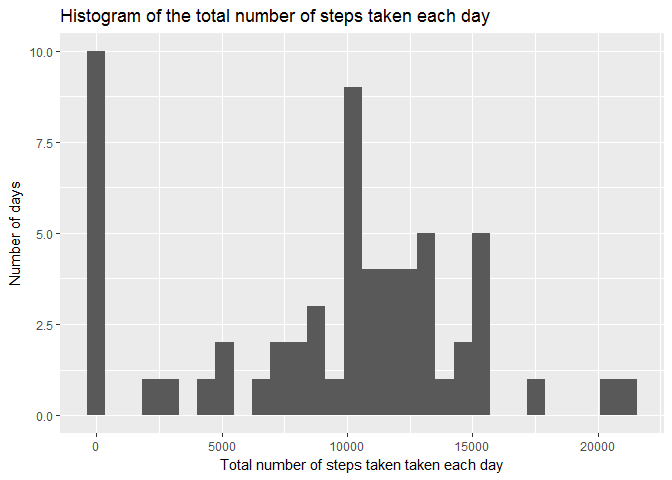
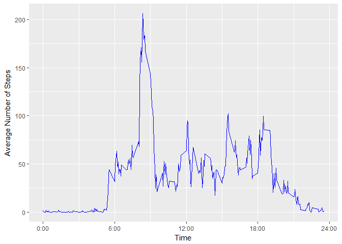
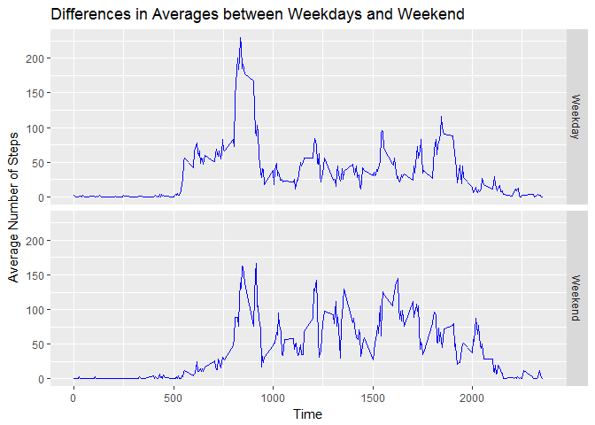

# Reproducible Research: Peer Assessment 1


## Loading and preprocessing the data


```r
library(ggplot2)
library(tidyverse)
```

```
## Loading tidyverse: tibble
## Loading tidyverse: tidyr
## Loading tidyverse: readr
## Loading tidyverse: purrr
## Loading tidyverse: dplyr
```

```
## Conflicts with tidy packages ----------------------------------------------
```

```
## filter(): dplyr, stats
## lag():    dplyr, stats
```

```r
if (!file.exists("Activity.zip")){
 download.file("https://d396qusza40orc.cloudfront.net/repdata%2Fdata%2Factivity.zip", 
              destfile = "data/Activity.zip")
 }

activity_data <- read.csv(file=unz('./Activity.zip','activity.csv'))
activity_data$date <- as.Date(as.character(activity_data$date), format="%Y-%m-%d")
```


## What is mean total number of steps taken per day?

 

```r
mean_med_activity_data <- activity_data %>% group_by(date) %>% 
  summarize(sumsteps = sum(steps, na.rm=TRUE))
 
plot(ggplot(mean_med_activity_data)+ geom_histogram(aes(x = sumsteps))+
       xlab("Total number of steps taken taken each day") + ylab("Number of days")+ggtitle("Histogram of the total number of steps taken each day"))
```

```
## `stat_bin()` using `bins = 30`. Pick better value with `binwidth`.
```

<!-- -->


```r
mean(mean_med_activity_data$sumsteps, na.rm=TRUE)
```

```
## [1] 9354.23
```

```r
median(mean_med_activity_data$sumsteps, na.rm=TRUE)
```

```
## [1] 10395
```


Mean is 9354.2295082 and median is 10395.

## What is the average daily activity pattern?

*1. Make a time series plot (i.e.  type = "l" ) of the 5-minute interval (x-axis) and the average number of steps taken, averaged across all days (y-axis)*


```r
avgDA <- activity_data %>% group_by(interval) %>% 
  summarize(avgsteps = mean(steps, na.rm=TRUE)) 

plot(ggplot(avgDA, aes(x=interval,y=avgsteps)) + geom_line(col = "blue") + 
       xlab("Time") + ylab("Average Number of Steps") + 
       scale_x_continuous(name = "Time",breaks = c(0,600,1200,1800,2400)  
                          ,label = c("0:00","6:00","12:00","18:00", "24:00")))
```

<!-- -->


*2. Which 5-minute interval, on average across all the days in the dataset, contains the maximum number of steps?*


```r
#the interval with maximum number of steps starts here: 
paste(floor(avgDA$interval[which.max(avgDA$avgsteps)]/100),avgDA$interval[which.max(avgDA$avgsteps)]-floor(avgDA$interval[which.max(avgDA$avgsteps)]/100)*100, sep=':')
```

```
## [1] "8:35"
```

```r
#end here:
paste(floor(avgDA$interval[which.max(avgDA$avgsteps)]/100),avgDA$interval[which.max(avgDA$avgsteps)]-floor(avgDA$interval[which.max(avgDA$avgsteps)]/100)*100+5, sep=':')
```

```
## [1] "8:40"
```


The interval with maximum number of steps starts at 8:35 and ends at 8:40.


## Imputing missing values

*1.Calculate and report the total number of missing values in the dataset (i.e. the total number of rows with  NA s)*


```r
sum(is.na(activity_data$steps))
```

```
## [1] 2304
```

 

The total number of rows with NAs is 2304. 
 
 
*2.Devise a strategy for filling in all of the missing values in the dataset. The strategy does not need to be sophisticated. For example, you could use the mean/median for that day, or the mean for that 5-minute interval, etc.*


I will use a mean for that 5-minutes interval as my imputation strategy.


*3.Create a new dataset that is equal to the original dataset but with the missing data filled in.*


```r
#repeating the previous step for the ease of access
avgDA <- activity_data %>% group_by(interval) %>% 
  summarize(avgsteps = mean(steps, na.rm=TRUE))

# add means to intevals; replace if NA and get rid of avgsteps 
activity_data_na_corrected <- left_join(activity_data,avgDA, by="interval") %>%
  mutate(steps = ifelse(is.na(steps),avgsteps,steps)) %>% select(-avgsteps) 
```


*4.Make a histogram of the total number of steps taken each day and Calculate and report the mean and median total number of steps taken per day. Do these values differ from the estimates from the first part of the assignment? What is the impact of imputing missing data on the estimates of the total daily number of steps?*


```r
avgDA_na_corrected <- activity_data_na_corrected %>% group_by(interval) %>% 
  summarize(avgsteps = mean(steps)) 

plot(ggplot(avgDA_na_corrected, aes(x=interval,y=avgsteps)) + geom_line(col = "blue") + 
       xlab("Time") + ylab("Average Number of Steps") + 
       scale_x_continuous(name = "Time",breaks = c(0,600,1200,1800,2400)  
                          ,label = c("0:00","6:00","12:00","18:00", "24:00")))
```

<!-- -->

## Are there differences in activity patterns between weekdays and weekends?

*1.Create a new factor variable in the dataset with two levels -- "weekday" and "weekend" indicating whether a given date is a weekday or weekend day.*


```r
activity_data_w_weekday <- activity_data_na_corrected %>% 
  mutate(WdayWend = ifelse(weekdays(date) %in% c('Saturday','Sunday'),"Weekend","Weekday")) %>% 
  mutate(WdayWend = as.factor(WdayWend))

avgDA_na_corrected_w_weekend <- activity_data_w_weekday %>% group_by(interval, WdayWend) %>% 
  summarize(avgsteps = mean(steps)) 
```
 

_2. Make a panel plot containing a time series plot of the 5-minute interval (x-axis) and the average number of steps taken, averaged across all weekday days or weekend days (y-axis). The plot should look something like the following, which was created using simulated data._

 

```r
ggplot(avgDA_na_corrected_w_weekend, aes(x=interval,y=avgsteps)) + 
  geom_line(col="blue") +facet_grid(WdayWend~.) + xlab("Time") + 
  ylab("Average Number of Steps") + 
  ggtitle("Differences in Averages between Weekdays and Weekend") 
```

<!-- -->
